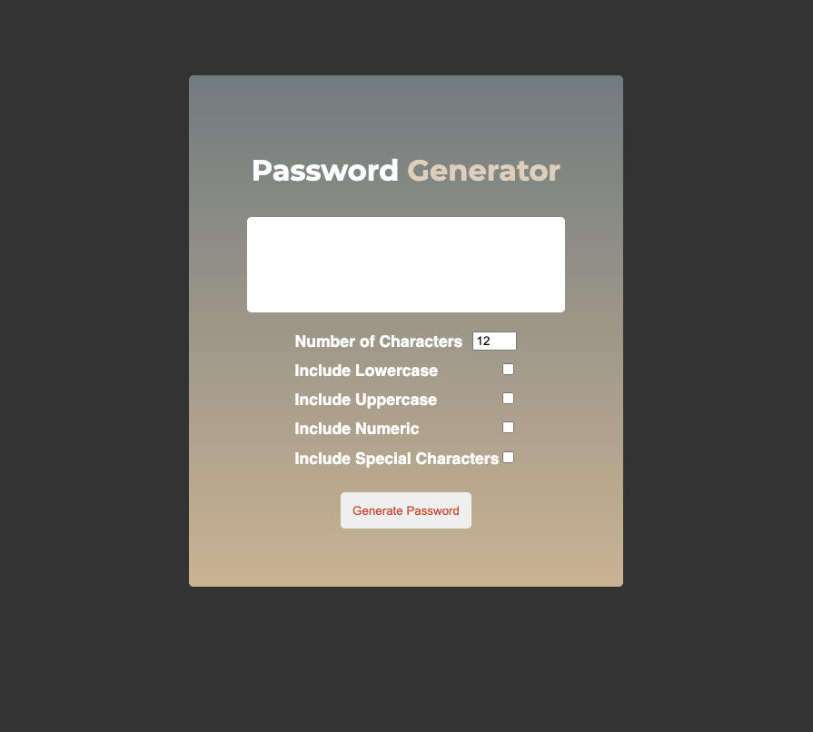

# Password-Generator

This passowrd Generator web apps allow users to generate random passwords based on criteria that they've selected. Users have the option to choose lowercase and uppercase characters, numericals and special characters which can be call symbols. The length of password can be choose between 8 to 128 characters. Have some fun playing this apps.

## Mock-Up

The following image shows the web apps appearance:

